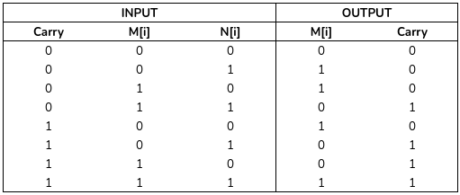
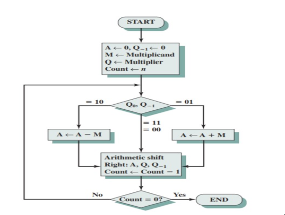

Collection of all asssignments done for Cryptology I Course. 
# Assignment 1

### Watch Imitation Game
> Watch the Imitation Game movie based on the biography of **Alan Turing**.

### Primitive polynominals

> Write C program to list all primitive polynomials from n=4 to n=16.

```c
#include <stdio.h>
#define SIZE 16

void toBin(int num) {
	for (int k = SIZE; k > 0; --k) {
		if ((num>>k)&1) printf("x^%d+",k);
	}
	printf("1\n");
}

int power(int base, int power) {
	int ret = 1;
	for (int i = 0; i < power; ++i) 
		ret = ret * base;
	return ret;
}

int mul(int m, int n) {
	int num1 = m;
	int num2 =n;
	int ret = 0;
	for (int i = 0; i < SIZE; ++i) {
		if (num2&1) ret = ret^num1;
		if (num2 == 0 ) break;
		num1 <<= 1;
		num2 >>= 1;
	}
	return ret;
}

int isValid(int num){ // Will check if the polynominal has 1 as a solution.
	if (num&1) return 0;
	int sum = 0;
	for (int k = 1; k < SIZE; ++k) {
		if (num & 1)
			sum += 1;
		num >>= 1;
	}
	if (sum&1)
		return 0;
	else
		return 1;
}

int main(void) {
	int len = power(2,SIZE+1);
	char Arr[len];
	for (int i = 1; i < len; ++i) {
		Arr[i] = 1;
	}

	for (unsigned int i = 3; i < len; i++) {
		if (Arr[i]==1) {
			for (int k = 2; k < len; ++k) {
				int value = mul(i,k);
				if (value > len) {
					break;
				} else if (!((value&1) && isValid(value))) {
					Arr[value] = 0;
				}
			}
		}
	}

	for (unsigned int i = 6; i < len; ++i) {
		if (Arr[i]==1) {
			toBin(i);
		}
	}
	return 0;
}
```
### LFSR
> Find out about Non-Linear Feedback registers of your own

### Berlekamp Massey

> Berlekamp_Massey algorithm implementation in C to find the shortest linear-feedback shift register (LFSR).

### Stream Cipher

```c
#include <stdio.h>
#include <stdlib.h>  
int main(void) {
  int n,k;
  printf("Enter length of the text:\n");
  scanf("%d",&n);
  printf("Enter the message text (with spaces):\n");
  for (int i = 0; i < n; ++i) {
      scanf("%d",&k);
      printf("%d ",k^(rand()%2));
  }
  return 0;
}

```
# Assignment 2

# Assignment 3

### n-bit addition and mulitplication
> Given M is a 2n bit integer and N is a n bit integer, find an algorithm to find M+N, M/N, and the complexity of the algorithm.

*For addition*
We have the bitwise addition alogorithm.

Consider f as function which acts according to the following
truth table.



```
Initialize M,N
Initialize carry = 0
for i from 0 to n-1;
	f(M[i],N[i],carry)

for i from n to 2n;
	f(M[i],0,carry)
```	


# Term Project
> Abstract:
Download the term project [here]()
